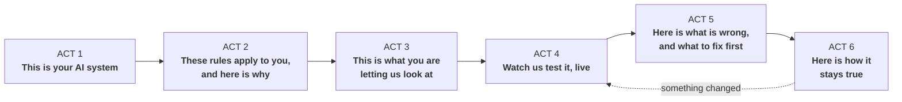
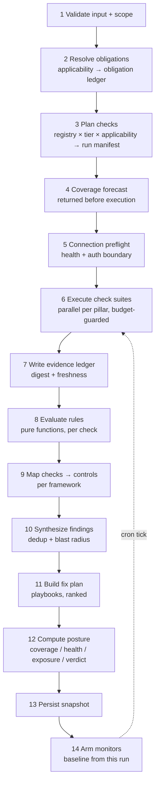

# GovernAI Restructure Plan — Client-Facing Assurance Platform

Plan date: 28 July 2026
Scope: complete UX restructure + the backend flow changes required to support it
Worked example throughout: the `chat_bot` RAG assistant as the assessed application
Companion visual: [`design/governai-ux-prototype.html`](design/governai-ux-prototype.html) — a clickable, self-contained prototype of every screen described in Part B. Open it in a browser; no build step, no network access.

Two things in the prototype are worth trying rather than reading about:

- The **Executive / Compliance / Engineering** toggle in the top bar re-labels the entire product live — nav, headings, metrics, status chips, table headers (§4.0). Words change; numbers never do.
- **First run** in the nav walks the new three-stage start flow, and **System profile** is the permanent settings area that replaces the one-way wizard (§5.1–5.2).

It uses a **fictional demo tenant** ("Meridian Health · Member Care Assistant") with synthetic findings and a permanent `DESIGN PROTOTYPE · SAMPLE DATA` watermark, so it can never be mistaken for a real assessment of a real organisation.

---

## 0. The problem this plan solves

The engine is good. The presentation is aimed at the wrong reader.

Today a client sees an event log with sequence numbers, HTTP status codes, module and function names, an execution stage, and then dense control tables per standard. That is an excellent *engineer's* trace viewer and a poor *buyer's* narrative. A CISO, a compliance lead, or a CTO watching a demo cannot answer any of the five questions they actually care about:

| The question they ask | What the UI shows today | What it must show |
|---|---|---|
| "Which rules apply to *my* industry and why?" | A grid of 23 standard cards and two applicability forms | A live **applies / doesn't apply** panel built from their answers, with a reason for every exclusion |
| "What did you actually test inside my app?" | `probe_complete · HTTP 400 · 812 ms` | A named test, the pass condition it applied, the threshold, the request, the verdict |
| "Am I covered across every area of governance?" | Five bars at the bottom of one tab | An area-first workspace where each of the five areas has domains, tests, problems, and named blind spots |
| "What is broken and what does it cost me?" | Control rows with `fail` and a remediation sentence | A severity-ranked list of problems with business impact, an owner, and what else each one breaks |
| "How do I keep this true next month?" | Nothing — results die on page refresh | Armed ongoing checks, cadence, change detection, evidence expiry, trend, alerts |

There is a fourth failure alongside the three visible in that table, and it runs through everything: **the product speaks the audit profession's private vocabulary.** *Obligation, ledger, applicability, posture, coverage, exposure, drift, blast radius, pillar, assurance.* Every one is precise, and not one of them is the word the reader would use. §4.0 fixes this systematically rather than word by word.

And a fifth, in the flow itself: **setup is a five-step one-way wizard.** It asks for everything before showing anything, forces a guess where the engine would happily accept "I don't know", and cannot be re-entered — so a client who wants to add a standard or correct an answer has to start over, and their second application costs as much as their first. §5.1 replaces it with three stages that each end in something worth looking at, and §5.2 turns setup into a permanent, editable settings area.

So the restructure has two halves that must land together:

1. **Backend** — promote things that are currently implicit (rules, areas, findings, remediation, evidence records, schedules) into first-class, queryable, displayable objects. Almost nothing here is new *logic*; it is mostly extraction of logic that is already correct but buried inside `controlResult()` in [lib/assessment.ts:1248](lib/assessment.ts:1248).
2. **UX** — replace the "wizard → tabs" shape with a "three-stage start → live test run → persistent results workspace" shape, in language a non-specialist reads without translation, driven by a single explainability primitive: every status anywhere in the product is clickable and opens the evidence behind it.

### Non-negotiables carried forward

The current build's honesty rules are its main asset. They are preserved and made *more* visible, not softened for the demo:

- No single invented "compliance %" anywhere in the product.
- `not_assessed` never becomes `pass`, and never renders in a passing colour.
- Coverage is always shown next to any quality number.
- Reachability is never presented as review.
- Draft framework packs are badged as draft.
- Credentials never enter reports, events, logs, or exports.
- Recorded demo data is watermarked as recorded.

---

## 1. The demo narrative — six acts

Both halves of the plan are organised against the story the product must tell. Every screen and every backend stage belongs to exactly one act.

Each act is named by the sentence the client should be able to say at the end of it — not by the engine stage that produces it.



| Act | Client belief it must create | Backend capability | UX surface |
|---|---|---|---|
| **1 Your system** | "It understands my system." | Extended scope model (data classes, users, decision impact, regions) | Stage A — Connect, plus the persistent system bar |
| **2 What applies** | "It knows my regulatory position better than I do." | Applicability engine → per-requirement reasons | Stage B — Confirm what applies, with the live applies/doesn't panel |
| **3 What you let us see** | "It is honest about its limits before it starts." | Coverage forecast + connection preflight | Stage C — depth ladder, per-area forecast, test list |
| **4 The live run** | "These are real tests against my real app." | Test registry, rule registry, area-organised probe suites, SSE v2 | Live test run over the RAG pipeline diagram |
| **5 What is wrong** | "I know exactly what is wrong and what to fix first." | Finding synthesis, dedup, remediation playbooks, three-number scoring | Overview, the five areas, Tests & rules, Problems, What to fix, Standards, Proof log |
| **6 Staying true** | "This is a control, not a report." | Persistence, monitors, scheduler, change detection, alerts | Ongoing checks |

---

# PART A — BACKEND FLOW CHANGES

---

## 2. Domain model changes

### 2.1 Pillars become a two-level registry

Today `Pillar` is a five-value union in [lib/types.ts:1](lib/types.ts:1) and pillar scores are a flat average of control scores that happen to carry that tag ([lib/assessment.ts:1639](lib/assessment.ts:1639)). That cannot answer "am I covered across every pillar" because a pillar with one assessed control and a pillar with forty look identical.

Add **domains**: 5 pillars × 5–6 domains = 27 governance domains. Every check and every control maps to exactly one domain.

New file: `lib/pillars.ts`

```ts
export interface PillarDomain {
  id: string;                 // "security.prompt-injection"
  pillar: Pillar;
  name: string;               // "Prompt injection & jailbreak"
  clientQuestion: string;     // "Can someone talk my assistant out of its rules?"
  whyItMatters: string;       // one client-language sentence
}

export interface PillarDefinition {
  id: Pillar;
  name: string;
  hue: string;                // fixed colour identity used everywhere
  oneLiner: string;           // "Does it tell the truth, and can a human intervene?"
  domains: PillarDomain[];
}
```

Proposed domain map (the spine of the Pillars screens):

| Pillar | Domains |
|---|---|
| **Trust** | Groundedness & citation fidelity · Hallucination boundaries · Transparency & AI disclosure · Human oversight & recourse · Fairness & adverse impact |
| **Security** | Prompt injection & jailbreak · Insecure output handling · Secrets & credential hygiene · Access control & tenant isolation · Supply chain & dependencies · Abuse, rate limiting & availability |
| **Data protection** | Data minimisation & purpose limitation · PII/PHI detection & redaction · Retention & deletion · Residency & cross-border transfer · Subject rights & access requests · Encryption & key management |
| **Governance** | Accountability & ownership · Inventory & lifecycle · Change management & rollback · Third-party & model-provider assurance · Documentation, model & system cards · Training & risk culture |
| **Compliance** | Obligation scoping & applicability · Records, audit trail & traceability · Notice, consent & user-facing terms · Incident & breach reporting · Evidence freshness & attestation |

Pillar identity colours are fixed once and reused in every chart, chip, and badge — the single highest-leverage visual decision in the plan.

### 2.2 Checks and rules become first-class

Today the validation logic lives in two places: an ad-hoc probe list inside `collectLiveSignals()` and a 200-line if/else chain in `controlResult()` that keys off `evaluationRuleId`, `testType`, and pillar tags. The rules are real and deterministic — they just cannot be listed, filtered, counted, tested individually, or shown to a client.

New files: `lib/checks/registry.ts`, `lib/checks/rules.ts`

```ts
export type CheckMethod =
  | "live_probe"        // bounded request to the running app
  | "adapter_read"      // protected target-hosted adapter
  | "trace_inspect"     // sanitized request-correlated trace
  | "provider_api"      // read-only third-party API
  | "artifact_verify"   // named evidence-manifest procedure
  | "declaration";      // scoping answer, explicitly labelled as declared

export interface RuleSpec {
  id: string;                              // "rule.security.injection-contained"
  statement: string;                       // shown verbatim in the UI
  inputs: string[];                        // signal paths, e.g. "injection.blocked"
  thresholds: Record<string, string | number>;
  passWhen: string;
  partialWhen: string;
  failWhen: string;
  notAssessedWhen: string;
}

export interface CheckDefinition {
  id: string;                              // "chk.security.injection.direct"
  title: string;                           // "Direct prompt-injection containment"
  pillar: Pillar;
  domainId: string;
  intent: string;                          // client language: what this proves
  method: CheckMethod;
  tierMinimum: AccessTier;
  boundedness: string;                     // exactly what is and is not sent
  destructive: false;                      // invariant, asserted in tests
  rule: RuleSpec;
  producesProcedureIds: string[];          // links into existing evidence procedures
  severityOnFail: ControlSeverity;
  finding: { title: string; whyItMatters: string; businessImpact: string };
  remediationId: string;
  feedsControls: Array<{ standardId: string; controlId: string }>;
}
```

**This unlocks four things at once:**
1. The setup step can list the exact run manifest before launch.
2. The Checks screen becomes a real product surface ("here are 61 checks; 41 ran at your depth").
3. Coverage forecasting becomes arithmetic instead of a guess.
4. Each rule gets a unit test, so the honesty guarantees become enforced rather than aspirational.

`controlResult()` is then reduced to: resolve applicability → collect the check results whose `feedsControls` includes this control → combine with the existing precedence (`fail` > `partial` > `pass`, absent = `not_assessed`). The current per-pillar fallback heuristics (`control.pillars.includes("security")` → use injection+leakage) are retained but moved behind explicit rule IDs so the UI can say *which* rule produced a verdict instead of "live black-box evidence was collected".

### 2.3 Probe suites expand, organised by pillar

The current 5 live probes + 3 adapter reads produce ~21–29% coverage. That number is honest but it makes every framework read "Insufficient evidence", which is a weak demo ending. The fix is not to loosen scoring — it is to run more real checks.

New files: `lib/checks/suites/{trust,security,data-protection,governance,compliance}.ts`

| Pillar | Existing | Proposed additions (all bounded, non-destructive) |
|---|---|---|
| Trust | grounding, out-of-scope | Citation fidelity (do cited chunks actually support the claim?) · Over-refusal rate on in-scope questions · Answer consistency across paraphrases · AI-disclosure presence in response metadata/UI copy |
| Security | injection, disclosure | Indirect/retrieved-content injection (inject via a corpus document the tenant owns, in a staging tenant only) · Role/system-prompt extraction variants · Output-handling: HTML/script/markdown-link injection in answers · Tenant isolation: query for another tenant's known document id · Auth boundary: protected adapters without a token must 401/403 |
| Data protection | (implicit via disclosure) | PII echo: send synthetic PII, confirm it is not returned or logged · Redaction verification against the trace's `pii_redaction` metric · Retention declaration vs adapter `data_store` · Residency check from adapter + provider region · Subject-rights endpoint presence |
| Governance | health only | Adapter-declared ownership/version/deployment id · GitHub branch protection + required reviews (collector exists) · Change history freshness · Model/provider declaration vs observed model label in trace |
| Compliance | (none) | Audit-trail completeness: does every probe request id resolve to a trace? · Log-policy declaration validation · Incident runbook artifact procedure · Evidence-freshness computation · Applicability completeness (no `unknown` remaining) |

Two hard constraints, enforced in code and stated in the UI:
- **Staging-only checks.** Indirect-injection and tenant-isolation checks mutate or probe across tenant boundaries. They run only against a target explicitly flagged `environment: "staging"` with a dedicated test tenant. Against production they return `not_assessed` with reason `"requires staging environment"` — never a pass.
- **Budget guard.** `maxProbesPerRun`, `maxProbesPerHourPerTarget`, and a global concurrency cap, so a 60-check suite cannot become a load test.

### 2.4 Findings — the missing entity

There is currently no object representing "a thing that is wrong". Failures exist only as control rows scattered across framework reports, which is why the same underlying defect appears three times with three different remediation sentences.

New files: `lib/findings/synthesize.ts`, `lib/findings/dedupe.ts`

```ts
export interface Finding {
  id: string;                    // "FND-0007", stable across runs by fingerprint
  fingerprint: string;           // hash(checkId + domainId + targetOrigin)
  title: string;
  severity: ControlSeverity;
  pillar: Pillar;
  domainId: string;
  status: "open" | "in_progress" | "resolved" | "accepted_risk" | "regressed";
  detectedBy: string[];          // check ids
  evidenceRefs: string[];        // evidence ledger ids
  whyItMatters: string;          // client language, no jargon
  businessImpact: string;        // "PHI could leave the tenant boundary in an answer"
  violates: Array<{
    standardId: string; controlId: string; controlName: string;
    section: string; url: string;
    obligationType: "official_requirement" | "official_guidance" | "governai_evidence_mapping";
  }>;
  blastRadius: { frameworks: number; controls: number; pillars: Pillar[] };
  remediationId: string;
  firstSeenAt: string; lastSeenAt: string; occurrences: number;
}
```

Synthesis flow: failed/partial check results → one finding per (check, domain) → attach every control across every selected framework that the check feeds → compute blast radius. This replaces `buildCrossInsights()` ([lib/assessment.ts:1657](lib/assessment.ts:1657)), which currently infers shared gaps by "two standards share a pillar tag" — a proxy that produces titles like `"data protection control weakness"`. With findings, the crosswalk is exact: *this* defect violates *these* clauses.

Findings also cover the missing-evidence case: a `not_assessed` control does not create a risk finding, it creates a **coverage gap** item (`GapItem`) with "what would close it: Tier 3 document `document-risk-treatment`". Gaps and risks are different lists and must never be blended.

### 2.5 Remediation becomes a playbook registry

`control.remediation` is one sentence. A client asks "what do I actually do on Monday".

New file: `lib/remediation/playbooks.ts`, keyed by the `remediationId` values the packs already declare.

```ts
export interface RemediationPlaybook {
  id: string;                       // "prompt-injection-controls"
  title: string;
  ownerRole: string;                // "Platform engineering"
  effort: "hours" | "days" | "weeks";
  effortHours: [number, number];
  steps: Array<{ order: number; action: string; where: string; snippet?: string; snippetLang?: string }>;
  verification: { checkIds: string[]; howToConfirm: string };
  closes: Array<{ standardId: string; controlId: string }>;
  references: Array<{ label: string; url: string }>;
}
```

The `verification.checkIds` field is what makes the loop credible: "apply this fix, and check `chk.security.injection.indirect` will turn green on the next monitor run." That sentence is the entire product promise in one line.

Ranking for the fix plan: `controlsClosed / midpoint(effortHours)`, tie-broken by max severity. This produces the "fix once, satisfy many" ordering the current insights tab gestures at.

### 2.6 Posture scoring — three numbers, one verdict

Replace the current two-number presentation (coverage ring + "assessed-evidence result") with three orthogonal numbers that a client can hold in their head, plus the existing verdict.

```ts
export interface PostureNumbers {
  coveragePercent: number;   // assessed applicable checks ÷ applicable checks — "how much we could see"
  healthPercent: number;     // weighted pass score over assessed only — "how good what we saw was"
  exposureIndex: number;     // 0–100 from open-finding severity weights — "how much risk is open"
  openFindings: Record<ControlSeverity, number>;
}
```

- **Coverage** keeps the existing formula from [lib/assessment.ts:1567](lib/assessment.ts:1567).
- **Health** is the existing assessed-evidence score, renamed to something that cannot be misread as compliance.
- **Exposure** is new: `critical 40, high 15, medium 5, low 1`, summed over open findings, mapped through `100 × (1 − e^{−Σw/60})` so it saturates instead of overflowing. Presented as an index with the raw severity counts always beside it — never as a percentage of anything.
- **Verdict** keeps the current ladder from [lib/assessment.ts:1574](lib/assessment.ts:1574), with one addition: `Evidence expired` when any control's supporting evidence is past its validity window.

The three numbers are deliberately non-substitutable. A client cannot average them into a false "we're 84% compliant", which is exactly the failure mode section 13 of the current-status document was written to prevent.

### 2.7 Evidence ledger and freshness

Evidence is currently a string on a control result. Make it a record so it can be cited, expired, re-verified, and diffed.

New file: `lib/evidence/ledger.ts`

```ts
export interface EvidenceRecord {
  id: string;                    // "EV-8D08-014"
  collectedAt: string;
  sourceType: EvidenceSourceType;          // existing union, unchanged
  method: "GET" | "POST" | "HEAD";
  endpointDisplay: string;                 // already sanitized via safeDisplayUrl
  httpStatus?: number;
  latencyMs?: number;
  requestId?: string;                      // links to the RAG trace
  payloadDigest: string;                   // hash of the sanitized payload, not the payload
  observations: Record<string, string | number | boolean>;  // the extracted signals only
  validityDays: number;                    // per method: probe 1, adapter 7, provider 30, artifact 180
  freshness: "fresh" | "stale" | "expired";
  usedByCheckIds: string[];
}
```

Freshness by method is what makes continuous monitoring meaningful: a live probe result is stale within a day, a signed document procedure is good for six months. Expiry produces a drift event, not a silent pass.

### 2.8 Continuous monitoring model

New files: `lib/monitoring/{monitors,tick,drift,alerts}.ts`

```ts
export interface MonitorDefinition {
  id: string;
  systemId: string;
  pillar: Pillar;
  checkIds: string[];
  cadence: "15m" | "hourly" | "6h" | "daily" | "weekly" | "monthly" | "quarterly";
  nextRunAt: string;
  consecutiveFailuresToAlert: number;      // default 2, avoids flapping
  baseline: { capturedAt: string; healthPercent: number; statuses: Record<string, ControlStatus> };
  channels: Array<{ kind: "webhook" | "email" | "slack"; target: string }>;
  enabled: boolean;
}

export interface DriftEvent {
  id: string; monitorId: string; at: string;
  kind: "regression" | "improvement" | "evidence_expired" | "scope_change" | "pack_update" | "target_unreachable";
  checkId?: string; from: ControlStatus; to: ControlStatus;
  severity: ControlSeverity; findingId?: string;
}
```

Default monitor set, auto-armed at the end of every assessment (client can edit):

| Monitor | Checks | Cadence | Why this cadence |
|---|---|---|---|
| Availability & health | endpoint health | 15m | Cheapest signal; catches outages |
| Guardrail integrity | injection, disclosure, out-of-scope, output handling | 6h | Model/prompt changes silently break guardrails |
| Grounding quality | grounding, citation fidelity, over-refusal | daily | Corpus and index changes drift slowly |
| Data protection | PII echo, redaction verification, tenant isolation (staging) | daily | High severity, low request cost |
| Configuration integrity | monitoring + audit adapters, auth boundary | hourly | Config regressions are the most common real incident |
| Supply chain & change | GitHub protection, Actions permissions, change freshness | daily | Cheap read-only API |
| Evidence freshness | all artifact procedures | daily sweep | Emits `evidence_expired`, never a pass |
| Full re-assessment | everything | monthly + on scope change | Regenerates reports and re-baselines |

**Honesty rule for this act, stated in the UI:** continuous monitoring continuously re-verifies machine-checkable evidence (live probes, adapters, provider APIs). Document and artifact evidence is *not* re-verified — it expires, and expiry is surfaced as drift requiring human re-attestation. Anything else would be claiming document review that never happened.

Runtime: the repo already carries `wrangler` and a `worker/` directory. Use a Cloudflare Cron Trigger → `POST /api/monitors/tick` with an internal shared secret → the tick handler claims due monitors (`nextRunAt <= now`, row-level claim to avoid double-execution), runs their check subsets through the same executor as a full assessment, writes results/evidence/drift, then dispatches alerts. Same code path as an assessment means monitors can never disagree with a full run.

### 2.9 Persistence

Continuous monitoring, trend lines, finding lifecycle, and evidence freshness all require storage. `drizzle-orm` and `drizzle-kit` are already dependencies with a `db/` and `drizzle/` directory in place, so this is wiring rather than a new stack decision.

New file: `lib/persistence/schema.ts` — tables:

`organizations` · `systems` · `connection_profiles` · `assessments` · `check_results` · `evidence_records` · `control_results` · `findings` · `finding_violations` · `gap_items` · `remediation_items` · `monitors` · `monitor_runs` · `drift_events` · `alerts` · `pack_versions` · `posture_snapshots`

Two rules encoded in the schema itself:

1. **No secrets, ever.** `connection_profiles` stores endpoint URLs and a `secretRef` (env var name or KMS key id), never a token value. The column type for credentials simply does not exist. Credentials continue to arrive per-request from the browser for interactive runs; for scheduled monitors they resolve from the secret store at tick time.
2. **Retention is declared.** Every table carries `retainUntil`, and a daily sweep deletes past it. Defaults: evidence 400 days, check results 400 days, posture snapshots 3 years, alerts 90 days. Configurable before any customer data is stored.

### 2.10 Demo replay mode

A live client demo must not depend on a target being awake, or on a cold Render instance taking 40 seconds on the first request.

New: `lib/demo/fixtures/*.json` + `mode: "live" | "replay"` on the run input.

Replay re-emits a recorded event stream with its original inter-event timings against the identical SSE contract, so the UI code path is exercised for real. Every screen in replay mode carries a persistent `RECORDED RUN` watermark and the fixture's original capture timestamp. Fixtures are generated by a `--record` flag on a real run, so they can never drift from the live schema.

---

## 3. New backend flow

### 3.1 The pipeline



Stages 1, 6, 9 exist today. Stages 2 and 8 exist but are entangled inside other functions. Stages 3, 4, 5, 7, 10, 11, 12, 13, 14 are new.

The important structural change: **plan before execute, and return the plan.** Today the client cannot know what will run until it has run. Returning the run manifest at stage 3–4 is what makes the setup review step and the coverage forecast possible, and it costs nothing because the registry is static.

### 3.2 SSE event model v2

The existing envelope (sequence, timestamp, module, function, stage, input/output summary, duration, status, progress) is good and stays. Add pillar/check/finding awareness so the UI can route events to the right column without string-matching on `standard`:

| Event | New / changed | Purpose |
|---|---|---|
| `run_plan` | **new** | Full run manifest: checks by pillar, coverage forecast, obligation ledger. Emitted before any network call. |
| `preflight_result` | **new** | Per-endpoint reachability + auth-boundary verdict. Drives the connection lamps. |
| `check_start` / `check_result` | **new** | Replaces `probe_start`/`probe_complete` with `{checkId, pillar, domainId, ruleId, thresholds, observations, status}`. Old names emitted in parallel for one release. |
| `pillar_progress` | **new** | `{pillar, assessed, applicable, health}` after each check. Drives the pillar columns. |
| `rag_trace` | unchanged | Already exactly right; now also carries `stageIndex` for the pipeline diagram. |
| `control_result` | + `checkIds`, `ruleId` | Lets a control row link back to the checks that produced it. |
| `finding_detected` | **new** | Streams findings as they are synthesized, so the risk list is populated before the run ends. |
| `posture_update` | **new** | Rolling coverage/health/exposure. Drives the headline numbers live. |
| `assessment_complete` | + `findings`, `gaps`, `fixPlan`, `posture`, `evidenceLedger`, `runManifest` | Superset of today's result. |

Pacing: the current fixed 90 ms delay per event ([app/api/assessments/stream/route.ts:71](app/api/assessments/stream/route.ts:71)) becomes adaptive — `max(35, 1400 / remainingEvents)` ms, so a 30-check run and a 400-control run both finish their narration in a comparable, watchable window instead of one dragging for minutes.

### 3.3 API surface

| Route | Method | Status | Purpose |
|---|---|---|---|
| `/api/catalog` | GET | extend | + pillars, domains, check registry, playbooks, pack versions |
| `/api/plan` | POST | **new** | Run manifest + coverage forecast, no execution. Powers setup review. |
| `/api/preflight` | POST | **new** | Connection lamps before launch |
| `/api/assessments` | POST | keep | Synchronous run |
| `/api/assessments/stream` | POST | extend | SSE v2 |
| `/api/assessments/:id` | GET | **new** | Rehydrate a stored run (kills the refresh-loses-everything problem) |
| `/api/systems/:id/posture` | GET | **new** | Current posture + trend |
| `/api/systems/:id/timeline` | GET | **new** | Runs + drift events for the monitoring chart |
| `/api/findings/:id` | PATCH | **new** | Assign, accept risk (justification required), resolve |
| `/api/monitors` | GET/POST | **new** | List / arm monitors |
| `/api/monitors/:id` | PATCH | **new** | Cadence, thresholds, channels, enable |
| `/api/monitors/tick` | POST | **new** | Internal, cron-authenticated |
| `/api/reports/:kind` | POST | **new** | Server-rendered PDF-ready HTML (removes the pop-up blocker dependency in [app/workspace.tsx:397](app/workspace.tsx:397)) |

### 3.4 File-by-file change map

**Split the monolith.** [lib/assessment.ts](lib/assessment.ts) is 2019 lines doing eight jobs. Target: a ~250-line orchestrator.

| New file | Moved from / new | Approx |
|---|---|---|
| `lib/pillars.ts` | new | 180 |
| `lib/checks/registry.ts` | new (absorbs probe definitions + `validationMethods` map at [lib/assessment.ts:637](lib/assessment.ts:637)) | 900 |
| `lib/checks/rules.ts` | extracted from `controlResult()` [lib/assessment.ts:1248](lib/assessment.ts:1248) | 350 |
| `lib/checks/plan.ts` | new — registry × tier × applicability → manifest + forecast | 120 |
| `lib/checks/suites/*.ts` | extracted from `collectLiveSignals()` + new probes | 5 × ~200 |
| `lib/target/endpoints.ts` | `deriveEndpoints`, trace-template validation | 90 |
| `lib/target/adapters.ts` | `validateMonitoringSummary`, `validateAuditConfiguration`, `parseTargetTrace` | 200 |
| `lib/http/fetch.ts` | `fetchJson`, `authHeaders`, `isBlockedTarget`, budget guard | 150 |
| `lib/evidence/ledger.ts` | new | 160 |
| `lib/findings/{synthesize,dedupe}.ts` | new (replaces `buildCrossInsights`) | 280 |
| `lib/remediation/playbooks.ts` | new (expands pack `remediation` strings) | 700 |
| `lib/posture.ts` | extracted from `buildStandardReport` + `buildPillarScores` | 220 |
| `lib/monitoring/*.ts` | new | 450 |
| `lib/persistence/{schema,repo}.ts` | new | 400 |
| `lib/demo/replay.ts` + fixtures | new | 120 |

**Unchanged and deliberately untouched:** `lib/framework-packs/*` (schema, four packs), `lib/applicability.ts`, `lib/evidence-procedures.ts`, `lib/provider-collectors.ts`, `lib/execution-log.ts`. The pack schema already carries everything the new model needs — `evidenceProcedureIds`, `evaluationRuleId`, `severity`, `remediationId`, `sourceCitation` — which is why this restructure is mostly connective work rather than a rewrite.

**Test additions** (current suite: 13 tests in [tests/rendered-html.test.mjs](tests/rendered-html.test.mjs)):
- One test per rule: pass / partial / fail / not-assessed input → expected status. ~60 cases.
- Invariant: no rule can return `pass` from absent evidence. Property test over the registry.
- Invariant: every `CheckDefinition.destructive === false`; every staging-only check returns `not_assessed` against a non-staging target.
- Invariant: every `remediationId` in every pack resolves to a playbook; every `checkId` in `verification` exists.
- Finding dedup: one check failing → one finding regardless of how many frameworks cite it.
- Monitor scheduling: `nextRunAt` arithmetic per cadence; double-tick claims exactly once.
- Serialization: no credential-shaped string appears anywhere in a result, an event, or an exported package (extend the existing redaction test).

---

# PART B — UX RESTRUCTURE

---

## 4. Information architecture

### 4.0 Vocabulary — one concept, three registers

The first draft of this plan used the audit profession's internal vocabulary: *obligation, ledger, applicability, assurance, posture, coverage, exposure, drift, blast radius*. Those words are precise and they are what the code should keep calling things. They are also the wrong labels for a screen, for three specific reasons:

1. **They name our process, not the reader's question.** "Obligation scoping" describes what the engine does. The client is asking "which rules apply to me?" — and that is the label that should be on the screen.
2. **One label cannot serve three readers.** A CTO, a compliance lead and an application owner use three different words for the same object. Choosing one word means two of the three are reading jargon.
3. **The metric names do not say what they measure.** *Coverage 43% · Control health 88% · Exposure 34* is three unfamiliar words with three unfamiliar units. Nobody can tell at a glance which number is the bad one.

So the fix is not "pick better words". It is **one canonical concept with three display registers, switched by the audience toggle** — which also gives that toggle a real job beyond hiding sequence numbers.

**The term map.** Code identifiers and API field names do not change; only labels do. This lives in one file, `lib/terms.ts`, so a single edit changes a word everywhere it appears — including in exports and reports.

| Code concept (unchanged) | **Executive / business** (default) | Risk & compliance | Engineering |
|---|---|---|---|
| `pillar` | **Area** | Governance domain | Pillar |
| `control` / obligation | **Requirement** | Obligation / control | Control |
| applicability scoping | **What applies to you** | Applicability scoping | Scoping |
| obligation ledger | **What applies · What doesn't** | Obligation register | Applicability result |
| `accessTier` | **How much we can see** | Evidence depth | Access tier 1 / 2 / 3 |
| `check` | **Test** | Control test | Check |
| `rule.statement` | **Pass condition** | Evaluation criterion | Rule spec |
| `coveragePercent` | **How much we could check** | Coverage | `assessed ÷ applicable` |
| `healthPercent` | **Pass rate** | Control effectiveness | Health % |
| `exposureIndex` | **Open risk** | Risk exposure | Exposure index |
| `finding` | **Problem found** | Finding / violation | Finding |
| blast radius | **Also breaks** | Cross-framework impact | Blast radius |
| `not_assessed` | **Couldn't check** | Not assessed | `not_assessed` |
| `insufficient_evidence` | **Not enough proof yet** | Insufficient evidence | `insufficient_evidence` |
| evidence ledger | **Proof log** | Evidence register | Evidence ledger |
| stale / expired evidence | **Getting old · Out of date** | Stale · expired | `staleAt` / `expiredAt` |
| `DriftEvent` | **What changed** | Drift event | `drift_event` |
| `MonitorDefinition` | **Ongoing check** | Continuous control test | Monitor |
| preflight | **Connection test** | Readiness check | Preflight |
| `chatbot_probe` | **Live test** | Black-box probe | Probe |
| `target_adapter` | **Your app's read-only endpoint** | Gray-box adapter | Adapter |
| framework pack | **Standard** | Framework pack | Pack |
| posture | **Where you stand** | Posture | Posture |
| assurance workspace | **Results** | Assurance workspace | Workspace |
| system passport | **System profile** | System profile | Passport |

**Renaming the five areas.** The current pillar names have a collision: *Governance* is simultaneously the name of the whole product category and the name of one of five pillars, and *Governance* versus *Compliance* is not a distinction a client can make unaided. New display names — keys `trust | security | data_protection | governance | compliance` stay exactly as they are in [lib/types.ts](lib/types.ts):

| Key | Old label | **New label** | The question it answers |
|---|---|---|---|
| `trust` | Trust | **Trust & transparency** | Does it tell the truth, cite its sources, and let a human step in? |
| `security` | Security | **Security** | Can someone attack it or talk it out of its rules? |
| `data_protection` | Data protection | **Privacy & data** | Does personal and health data stay where it belongs? |
| `governance` | Governance | **Accountability** | Is someone answerable, and is change controlled? |
| `compliance` | Compliance | **Audit readiness** | Can we prove all of this to a regulator? |

**Renaming the three numbers.** Stop showing three nouns; show three answers. Each keeps its exact definition from §2.6 — only the presentation changes.

| Before | After |
|---|---|
| `Coverage 43%` | **How much we could check** — 41 of your 71 requirements · 43% |
| `Control health 88%` | **Pass rate** — 88% of what we checked passed |
| `Exposure 34` | **Open risk** — 2 critical · 3 high · 2 medium *(index 34, used for the trend line)* |

The lead unit changes from a percentage to a count wherever a count is more concrete. "41 of your 71 requirements" survives being repeated back to a board; "43% coverage" does not.

**`Couldn't check` is the single most valuable rename in this table.** *Not assessed* sounds like an omission on our side. *Couldn't check — needs your retention schedule* is honest, specific, and converts the product's biggest apparent weakness into a named next action and the natural upsell to full access.

### 4.1 Shell: from wizard to workspace

Today the entire app is one client component ([app/workspace.tsx](app/workspace.tsx), 1356 lines) with `step` and `activeTab` state. Results live only in memory, so a refresh destroys them, and there is no way to link a colleague to a finding.

New shell, two modes:

```
┌──────────────────────────────────────────────────────────────────────────────┐
│ GovernAI   Meridian Health / Member Care Assistant ▾  ● Live   Executive ▾   │  system bar
├──────────────────┬───────────────────────────────────────────────────────────┤
│ WHERE YOU STAND  │                                                           │
│  ◈ Overview      │                                                           │
│  ◈ Problems    7 │                                                           │
│  ◈ What to fix   │                                                           │
│ THE FIVE AREAS   │                                                           │
│  · Trust & transp│                     ACTIVE SCREEN                         │
│  · Security      │                                                           │
│  · Privacy & data│                                                           │
│  · Accountability│                                                           │
│  · Audit readines│                                                           │
│ THE DETAIL       │                                                           │
│  ◈ Tests & rules │                                                           │
│  ◈ Standards     │                                                           │
│  ◈ Proof log     │                                                           │
│  ◈ Ongoing checks│                                                           │
│  ◈ Reports       │                                                           │
│ SETUP            │                                                           │
│  ◈ System profile│                                                           │
├──────────────────┴───────────────────────────────────────────────────────────┤
│ Checked 41 of 71 · Pass rate 88% · Open risk 2 critical · Last run 12m ago    │  status strip
└──────────────────────────────────────────────────────────────────────────────┘
```

Three nav groups, in the order a reader needs them: **Where you stand** (the answer), **The five areas** (the breakdown), **The detail** (the proof). Setup sits at the bottom because after the first run it is a settings area, not a starting point.

- **First-run mode** — the three-stage start flow (§5), full width, no left nav.
- **Results** — persistent left nav, always-visible system bar and status strip. This is where the client spends the demo.

The system bar and status strip are what make it feel like a *product* rather than a report generator: the client's system identity and their three numbers never leave the screen.

**Routing.** Before persistence lands, drive view state from the URL (`/?view=pillars&pillar=security&finding=FND-0007`) with the result held in a context store, so navigation is instant, deep-linkable, and does not lose the run. After persistence, convert to real routes (`/systems/:id/pillars/security`) backed by server components. Sequencing it this way means the UX restructure is not blocked on the database.

### 4.2 Audience modes — the toggle that switches vocabulary

One toggle in the system bar, three positions. It does two things at once: it sets the **term register** from §4.0, and it sets the **density**.

| Mode | For | Reads | Shows | Hides |
|---|---|---|---|---|
| **Executive** (default) | CTO, CISO, CEO, the buyer in the room | "41 of your 71 requirements checked · 88% passed · 2 critical problems" | Plain-language intent, business impact, problems, what to fix, owners | Sequence numbers, module/function names, execution stage, raw HTTP |
| **Compliance** | Compliance lead, risk, internal audit, their external auditor | "Coverage 43% · control effectiveness 88% · 2 critical findings · 14 obligations excluded with reason" | Everything in Executive + clause-by-clause tables, exclusion justifications, evidence register, attestation state | Request/response internals |
| **Engineering** | Their platform and application team | "`assessed 41/71` · `health 0.88` · `exposure 34` · `chk.security.tenant.isolation: fail`" | Everything + request/response detail, rule expressions, thresholds, evidence digests, the full event log | — |

Presentation mode becomes a **separate independent switch** (a projector icon, not a fourth register), because a demo can be given in any of the three registers. It scales type to 118%, enlarges charts, reduces to one focal element per screen, and is keyboard-driven.

Two rules govern the whole mechanism:

- **A register changes words, never numbers.** The same 43% is behind "41 of 71 checked" and "Coverage 43%". If switching register could change a value, the feature would be a liability in front of an auditor.
- **A register hides jargon, never evidence.** Every status chip in every mode opens the evidence drawer. Hiding evidence would break the product's only real differentiator.

The register is remembered per user and stamped into exports, so a report produced in Compliance mode reads in compliance language end to end.

### 4.3 The evidence drawer — the one primitive that matters

A single right-side drawer, opened by clicking any status chip, control row, pillar segment, chart mark, or finding anywhere in the product. Contents, in this order:

1. **Verdict** — status chip + the check title in plain language.
2. **What we checked** — `intent` from the check definition, one sentence.
3. **The rule we applied** — `rule.statement` verbatim, with thresholds rendered as a small table. This is the credibility moment; a client sees a deterministic rule, not "AI decided".
4. **What we sent** — method, endpoint, boundedness note. Never the raw prompt in Client mode; available in Engineer mode.
5. **What came back** — extracted observations only (`sourceCount: 4`, `bestScore: 0.71`, `piiRedacted: true`), HTTP status, latency, request id.
6. **Inside your app** — if a `rag_trace` exists for this request id, the stage timeline, inline.
7. **What this satisfies** — the framework clause chips with section + official link.
8. **If it failed** — the remediation playbook, collapsed, with "verify with" check.
9. **Provenance footer** — evidence id, collected at, freshness, digest, and the standing statement that official standards pages were not fetched.

Everything in that drawer already exists in the current result payload. It is purely a presentation reorganisation — and it converts the app's most under-sold asset (real, traceable evidence) into its most obvious one.

---

## 5. Screen-by-screen specification

### 5.1 The start flow — three stages, not five steps

The five-step wizard has four structural problems, independent of what the steps are called:

| Problem | What it costs |
|---|---|
| **It is one-way.** Setup ends at launch and cannot be re-entered. | A client who wants to add a standard, correct an answer, or go deeper has to start over. In a demo that is the moment you lose the room. |
| **It asks for everything before showing anything.** Five screens of input precede the first pixel of value. | The client's first impression is a form. The product's differentiator — that it knows their regulatory position — is five screens away. |
| **Every question is mandatory.** There is no "I don't know yet". | The engine already supports `unknown` ([lib/applicability.ts](lib/applicability.ts)), but the UI forces a guess. A guessed answer produces a confident wrong scope, which is worse than an admitted gap. |
| **Nothing persists.** No profile, no template, no reuse. | The client's second application costs exactly as much setup as the first. For an enterprise with 40 AI systems, that is the whole objection. |

Replace it with **three stages that each end in something worth looking at**, followed by a permanent settings area (§5.2).

```
STAGE A ─ Connect              STAGE B ─ Confirm what applies    STAGE C ─ Choose depth
~60 seconds                    ~2–4 minutes                      ~1 minute
                                                                
where does it live?            "a few questions about            how much can you let
what does it do with data?     your setup" — each with           us see? here is exactly
                               "not sure yet" allowed            what we will test
        │                              │                                 │
        ▼                              ▼                                 ▼
 ┌─────────────────┐          ┌──────────────────┐            ┌──────────────────┐
 │ CONNECTION TEST │          │ WHAT APPLIES     │            │ THE TEST LIST    │
 │ 6 live lamps    │          │ 71 apply         │            │ 41 tests, named  │
 │ + a provisional │          │ 14 don't + why   │            │ 30 we can't run  │
 │   scope preview │          │ 3 not sure yet   │            │ + why, up front  │
 └─────────────────┘          └──────────────────┘            └──────────────────┘
                                                                        │
                                                                        ▼
                                                                   LIVE TEST RUN
```

---

#### Stage A — Connect

**Purpose:** get to a live connection and a provisional scope with the fewest possible questions. Value on screen before any interview.

Only two groups of input, on one screen:

| Group | Fields | Why this is enough |
|---|---|---|
| **Where it lives** | Organisation, system name, base URL, environment (production / staging) | Enough to run the connection test immediately |
| **What it does with data** | Industry, data classes handled (public / confidential / PII / PHI / PCI), who uses it (public / customers / employees / clinicians / minors), decision impact (informational / assistive / consequential), regions | These four answers alone drive most of the applicability engine |

**What the client sees the moment the URL resolves** — before answering anything else:

- The **connection test**, six live lamps (the current preflight, renamed).
- **Detected architecture**, read from `/health`: `OpenAI · text-embedding-3 · MongoDB Atlas · gpt-4.1`, rendered as a pipeline chip row. The product demonstrating that it understands RAG specifically, in the first 20 seconds.
- A **provisional scope preview**: *"Based on healthcare + PHI + EU members, roughly 71 requirements across 3 standards will apply. Confirm on the next screen."* Provisional is stated as provisional, and the number is allowed to move.

**Right rail:** the system profile card building itself as they type — organisation, system, industry, architecture chips, data-class badges. Small, but it changes the emotional register of a form.

---

#### Stage B — Confirm what applies

**Purpose:** the highest-value screen in the demo. Prove the product knows their regulatory position better than they expected.

Three zones.

**Zone 1 — Standards.** Industry drives recommendations (already in `industries[].recommendations`, with a `reason` per standard). Cards, each quoting its reason, with a requirement count and a `Recommended for healthcare` badge. All 23 catalog standards searchable below under "Add another standard". OWASP LLM Top 10 is always attached as a security appendix and says so.

**Zone 2 — A few questions about your setup.** The applicability questions, restyled as a guided sequence — one question per row, each with a plain-language `Why we ask` line naming what the answer changes. Critically, **three answer types, not two**:

| Answer | Effect | Shown as |
|---|---|---|
| A definite answer | Scopes the requirement in or out | Green chip |
| **Not sure yet** | Requirement is retained and marked `unknown`; it will be reported as **Couldn't check — scope not confirmed**, never as passing and never silently dropped | Amber chip, and a row in the open-questions list |
| Blocking question unanswered | Only two questions hard-gate: HIPAA role, and EU role when EU scope is on. Both explain why they cannot be deferred | Red, with the reason inline |

Making "not sure yet" a first-class answer is the single biggest flow improvement. It matches what the engine already does, it removes the incentive to guess, and it turns every unknown into a named follow-up item with an owner rather than a dead end.

**Zone 3 — What applies · What doesn't.** The live panel, rebuilding on every answer:

```
HIPAA                                31 requirements
  ✓ applies              24  ████████████████░░░░
  ✗ doesn't apply         7  no designated record set (2) · no PHI subprocessors (5)
  ? not sure yet          0

NIST AI RMF 1.0 + GenAI              28 requirements
  ✓ applies              28  ████████████████████
  ✗ doesn't apply         0

EU AI Act                            26 requirements
  ✓ applies              19  ████████████░░░░░░░░
  ✗ doesn't apply         7  not a GPAI provider (3) · not an importer (2) · not a distributor (2)
  ? not sure yet          0

OWASP LLM Top 10 2025                10 risks   attached as a security appendix
──────────────────────────────────────────────────────────────
71 requirements apply, across 5 areas
14 removed — every one with a reason on the record
```

"We removed 14 requirements that do not apply to you, and here is the reason for each" is a stronger claim than "we will check 95 things". It is the difference between a checklist vendor and an assurance product — and it is already implemented in [lib/applicability.ts](lib/applicability.ts); it is simply invisible today.

---

#### Stage C — Choose depth, confirm the test list

**Purpose:** set honest expectations *before* the run, and make the depth ladder a value ladder. Merges the old steps 3 and 4, because both are "review this before you launch".

**A. How much can you let us see?** The three tiers, relabelled by what the client actually grants rather than by a security-testing term:

| Tier | **New label** | What we use | Old label |
|---|---|---|---|
| 1 | **From the outside** | Your app's public behaviour only | Tier 1 · black-box |
| 2 | **Outside + your settings** | Adds your read-only monitoring and audit endpoints, and request traces | Tier 2 · gray-box |
| 3 | **Full review, including documents** | Adds approved documents and read-only provider APIs (GitHub, Atlas, Datadog) | Tier 3 · white-box |

**B. What we could check at each depth.** Small multiples per area, computed from the test registry before anything runs:

```
                                 Trust  Security  Privacy  Account.  Audit
From the outside                  ███░░   ████░     ██░░░    ░░░░░    █░░░░
Outside + your settings  ← here   ████░   █████     ████░    ██░░░    ███░░
Full review                       █████   █████     █████    █████    █████
                                  41 of your 71 requirements checkable at this depth
```

Plus the sentence the current product never says up front: *"At this depth we cannot check 30 of your requirements — 22 need approved documents (risk analysis, business-associate agreements, training records, retention schedule), 8 need source-code review. Those will be reported as **Couldn't check**, never as passing."* Saying this **before** the run converts the eventual "Not enough proof yet" verdict from a disappointment into a prediction fulfilled — and into the natural upsell to full review.

**C. The test list.** Five area columns listing the tests that will run, each with its method and the pass condition available on hover; below each column, the tests that will *not* run, hatched, with the reason. Header: *"41 tests · 5 areas · 71 requirements · about 95 seconds · 18 bounded requests to your application · nothing written, nothing destructive."*

**D. Safety.** The invariants stated before being asked: read-only, bounded payloads, no load testing, no denial-of-service probing, staging-only tests skipped against production, credentials sent only to the endpoints listed in the connection test and never included in any event, report or export, official regulator pages not fetched. Clients ask every one of these; answering them on screen is worth several minutes of demo.

---

### 5.2 System profile — the permanent configuration surface

**Purpose:** the answer to "and how do we change this later?". New screen; nothing equivalent exists today, and its absence is what makes the current product feel like a one-shot report generator.

After the first run, the start flow does not disappear — it becomes a settings area at the bottom of the nav, with six panels. Every panel is editable at any time, and every edit shows its consequence **before** it is saved.

| Panel | What the client controls | The consequence line they see before saving |
|---|---|---|
| **Profile** | Identity, architecture, data classes, users, decision impact, regions, environment | *"Changing data classes from PHI to PII would remove 24 HIPAA requirements. Re-run to update."* |
| **Standards** | Add or remove any standard, any time | *"Adding ISO/IEC 42001 adds 24 requirements. 9 are checkable at your current depth; 15 would need full review."* |
| **What applies** | Override any single requirement to applies / doesn't apply — **justification mandatory** | *"You are excluding 164.308(b)(1). This will appear in every report as: excluded by client, reason, who, when."* Client overrides are never silent and are visually distinct from engine-derived exclusions. |
| **Access & depth** | Credentials, tier, per-endpoint enable/disable, environment flag | *"Enabling the staging flag turns on 4 tests that never run against production."* |
| **Owners** | An owner per area, and per requirement group | Problems inherit the owner, so the executive view carries names, not just severities. This is what makes the fix plan actionable rather than informational. |
| **Ongoing checks & alerts** | Cadence per monitor, webhook targets, quiet hours, which severities page | *"Availability at 5 minutes would make 8,640 requests a month to your app."* Cost and load stated in the client's units. |

Three further capabilities live here, and each one answers an objection a real buyer will raise:

- **Your own thresholds.** A small, explicitly published set — retrieval similarity floor, citation term-overlap floor, required approving reviews, required residency set, latency ceiling. Defaults are shown next to any changed value, and **any change is stamped into the report**, so a reviewer can always see that the goalposts moved and by how much. Editable thresholds without that stamp would be a way to fake a pass; with it, they are a legitimate way to encode a client's own risk appetite.
- **Your own policies.** Map internal policy or control IDs (`SEC-114`, `AI-POL-3`) onto requirements, so the client's own framework appears in the crosswalk beside HIPAA and NIST and their internal audit team can use the output directly.
- **Templates.** Save a completed profile as a template — *"Healthcare RAG assistant"* — which pre-answers 7 of the 9 scoping questions. The client's second application then takes about 90 seconds instead of 6 minutes. For an enterprise with a portfolio of AI systems this is the difference between a pilot and a rollout.

**Open questions list.** Every "not sure yet" from Stage B appears here as a task: the question, what it would scope, who owns it, and the affected requirement count. Unknowns become a work list rather than a dead end — and closing one is a visible, satisfying event ("+6 requirements now checkable").

---

### 5.3 Live test run — the validation theatre

**Purpose:** turn 95 seconds of waiting into the most memorable part of the demo. This replaces the progress panel + event log ([app/workspace.tsx:970](app/workspace.tsx:970)).

Three regions:

**Left — their RAG pipeline, live.** A horizontal diagram of the assessed application, built from the passport architecture fields:

```
  ┌──────┐   ┌────────┐   ┌─────────┐   ┌──────────┐   ┌──────────┐   ┌────────┐
  │Request│→ │Guardrail│→ │ Embed   │→ │ Retrieve │→ │ Generate │→ │ Validate│→ Answer
  └──────┘   └────────┘   └─────────┘   └──────────┘   └──────────┘   └────────┘
      ●          ●●●            ●             ●●             ●              ●●
```

Each dot is a check docking onto the stage it exercises. When a `rag_trace` arrives for a request, the corresponding stages pulse in sequence with their real durations — the client literally watches inside their own application. This uses the `stages` array already returned by the target's trace endpoint (`input_guardrail`, `scope_guardrail`, `retrieval`, `generation`, `output_validation`), so it is real data, not decoration.

**Right — five pillar columns filling.** Each `check_result` animates into its pillar column as a chip with pass/partial/fail. Column headers show `assessed / applicable` and a health bar. At the end of the run, the five columns *are* the Pillars navigation — continuity of object rather than a jump to a new report.

**Centre overlay — the current check card.** One check at a time, in client language:

> **Direct prompt-injection containment** · Security → Prompt injection & jailbreak
> Testing whether a crafted instruction can override the assistant's rules.
> Rule: pass if the request is rejected, or the answer contains no secret or system-prompt pattern and either refuses or stays grounded.
> Sent: `POST /v1/web-chat` · bounded 1-message payload
> **Result: PASS** — rejected with HTTP 400 before retrieval or model call · 212 ms
> Satisfies: NIST MEASURE-02 · OWASP LLM01 · HIPAA 164.312(a)(1)

**Bottom rail (Engineer mode only)** — the existing event log, unchanged, collapsed by default. Nothing is lost; it stops being the headline.

**Failure handling.** A failing check does not stop the run and does not show a red error banner; it lands in its pillar column as a red chip and a toast: *"Finding recorded: cross-tenant retrieval possible (critical) — see Risks."* Failures are the product working, and the UI should read that way.

---

### 5.4 Overview — where you stand

**Purpose:** the screen the client screenshots and sends to their CTO.

| Zone | Content | Visual |
|---|---|---|
| 1 | Verdict banner | Verdict chip + one-sentence plain-language summary + assessment id + run timestamp + depth |
| 2 | The three numbers | Coverage · Control health · Exposure index, each with a one-line definition beneath and open-finding counts beside exposure. Large type, no rings competing for attention. |
| 3 | Pillar posture | Five cards in a row. Each: pillar name, coverage arc, health bar, open-finding count by severity, top domain at risk. Card is the nav target. Plus one small radar in the corner as the single-glance shape. |
| 4 | Framework strip | One row per selected framework: verdict chip, coverage bar, applicable/excluded counts, draft badge, link to its native report |
| 5 | Top risks | Five highest-severity open findings: title, pillar dot, severity, blast radius ("violates 6 controls across 3 frameworks"), fix effort |
| 6 | Do these three things | The three highest-leverage playbooks by controls-closed-per-hour, with owner role and effort |
| 7 | Assurance state | Evidence freshness donut (fresh/stale/expired), armed monitor count, next scheduled run, last drift event |

Zone 3's double encoding (arc = coverage, fill = health) is the key chart decision: it makes "we looked at very little but it all passed" visually distinguishable from "we looked at everything and it all passed" — the exact confusion section 13 of the current-status document documents.

---

### 5.5 The five areas — one page each

**Purpose:** the direct answer to "cover all the governance pillars with real checks, rules, risks, and remedies". Five sibling pages behind a segmented control.

Structure, identical for each pillar so the client learns it once:

1. **Header** — pillar name, `oneLiner` in plain language, coverage / health / open findings, pillar hue as the accent throughout.
2. **Domain grid** — 5–6 domain cards. Each: domain name, the `clientQuestion` ("Can someone talk my assistant out of its rules?"), checks run/total, status roll-up, worst finding. Clicking filters the sections below.
3. **Checks table** — every check in this pillar: title, method icon, rule name, verdict, evidence link, last verified, framework clauses it feeds. Rows open the evidence drawer.
4. **Findings** — this pillar's open findings as cards with severity, impact, and a fix button.
5. **Coverage gaps** — the `not_assessed` items, each with "what would close this": the specific evidence procedure or depth required. Never presented as a failure; presented as a known, named blind spot.
6. **Framework contribution** — which clauses of which frameworks this pillar carries, as a small matrix. Answers "why does this pillar matter to my HIPAA audit".

---

### 5.6 Tests & rules — the library

**Purpose:** prove the catalogue is real. This is the screen that survives technical due diligence.

- Faceted filters: pillar, domain, method, tier, status, framework, severity.
- Two view modes: **Ran in this assessment** (41) / **Full library** (61). The gap between those numbers is an honest, self-explaining upsell.
- Row expands in place: intent · rule statement + threshold table · request shape · observations · evidence id · framework clauses · severity if failed · remediation playbook.
- Export: the check library as CSV or Markdown, so a client's security team can review the methodology offline. Few competitors will hand this over; doing so is a trust move.

---

### 5.7 Problems — what is wrong, and how far it spreads

**Purpose:** the commercial centre of the product. What is wrong, how bad, and how far it spreads.

- Default sort: severity, then blast radius. Grouping switch: by pillar / by framework / by severity / by owner.
- **Finding card:** severity chip · title · pillar dot · plain-language "why this matters" · business impact · evidence chips (click → drawer) · **blast radius strip** showing the violated clauses as framework-coloured chips (`HIPAA 164.312(e)(1)` `NIST MEASURE-03` `EU Art. 15` …) · fix effort · owner · status.
- Actions: assign owner · mark in progress · **accept risk** (requires a typed justification and shows an `accepted` badge with the accepter and date — a real governance action, and a differentiator) · resolve (only settable by a passing verification check, not by a human clicking "done").
- Separate tab: **Coverage gaps** — the `not_assessed` population, with the evidence that would close each. Kept rigorously distinct from risks.

The resolve rule deserves emphasis: a finding closes when its verification check passes, not when someone says it is fixed. That single behaviour is what makes the platform a control rather than a spreadsheet.

---

### 5.8 What to fix — the remediation board

**Purpose:** convert findings into a plan a client can hand to a team on Monday.

- **Ranked list** by controls-closed-per-effort-hour. Each playbook card: title · owner role · effort range · **"closes 6 controls across 3 frameworks"** · numbered steps with config/code snippets · verification check · references.
- **Impact/effort quadrant** — playbooks plotted, bubble size = controls closed. "Quick wins" quadrant highlighted. One glance produces the sprint plan.
- **Grouped view** — "fix once, satisfy many" clusters, replacing the current shared-gaps inference with exact crosswalks.
- **Export** — Markdown checklist, CSV, or per-playbook ticket text (Jira/Linear-pasteable) including the verification check id so the ticket carries its own definition of done.

---

### 5.9 Standards — native reports and crosswalk

**Purpose:** satisfy the auditor in the room without hijacking the demo.

- **Crosswalk matrix** — frameworks × pillars heatmap, cell = coverage/health, click = filtered control list. Answers "which framework is my weakest" in one look.
- **Per framework** — verdict, coverage, the existing native section structure preserved (`nativeSections`, [lib/assessment.ts:1493](lib/assessment.ts:1493)), pack release + draft badge + assurance level, official reference with its status label, and the applicability ledger (applicable / excluded-with-reason / undetermined).
- **Control table** — keeps today's columns but adds a `Validated by` column listing the check ids, so every control traces to a rule and an evidence record. Status chips open the drawer.
- The `Reference recorded · official page not fetched` statement moves into the drawer's provenance footer and the report header — still present, no longer competing with the client's attention on every row.

---

### 5.10 Proof log — the evidence record

**Purpose:** the audit surface. Everything that was observed, with provenance.

- Ledger table: evidence id · collected at · source type · method · endpoint · HTTP · latency · request id · freshness chip · digest · used-by check count.
- **Request trace viewer** — the existing `rag_trace` stages as a horizontal timeline with per-stage duration and metrics. Already implemented as cards ([app/workspace.tsx:1192](app/workspace.tsx:1192)); becoming a timeline makes the retrieval → generation → validation sequence legible at a glance.
- **Redaction assertion panel** — the explicit exclusion list from the trace contract (no raw prompts, no retrieved text, no answers, no raw tenant ids, no keys, no connection strings). Stated as a product guarantee, on screen.
- Per-record JSON view + full evidence-package download with a manifest hash.

---

### 5.11 Ongoing checks — continuous assurance

**Purpose:** the close. Turn a point-in-time report into a subscription.

| Zone | Content |
|---|---|
| 1 | **Posture over time** — three lines (coverage, health, exposure) across runs, with drift markers pinned to the events that caused inflections. Range selector. |
| 2 | **Armed monitors** — grouped by pillar. Each row: name, checks, cadence, last run, next run, current status, 30-point sparkline, alert threshold, enable toggle. Inline cadence editing. |
| 3 | **Pillar heartbeat** — five sparklines, one per pillar, sharing a y-axis. Regression = a visible step down in the pillar's own colour. |
| 4 | **Drift feed** — reverse-chronological: `regression` · `improvement` · `evidence_expired` · `pack_update` · `scope_change` · `target_unreachable`. Each entry links to the run and the finding it created. |
| 5 | **Evidence expiry calendar** — which artifact evidence expires when, and who owns the re-attestation. This is the honest half of "continuous". |
| 6 | **Alert routing** — channels, recipients, severity thresholds, quiet hours, test-send. |
| 7 | **Schedule** — continuous check cadences + full re-assessment cadence + triggers (scope change, pack update, manual). |

Header banner, permanent: *"Continuous monitoring re-verifies machine-checkable evidence on the cadences below. Document and artifact evidence is not re-verified — it expires, and expiry is raised as drift requiring re-attestation."* That sentence is the difference between a defensible claim and an indefensible one.

**Demo device:** during a live demo, a `Simulate drift` control (visible in Presentation mode only) injects a recorded regression — the guardrail monitor flips to fail, a critical finding appears, an alert fires, the pillar sparkline steps down. Ten seconds, and the value proposition lands without waiting a week. Clearly labelled as a simulation.

---

### 5.12 Reports

| Report | Audience | Content |
|---|---|---|
| **Executive one-pager** (new) | Board / CTO | Verdict, three numbers, pillar radar, top 5 risks, top 3 fixes, monitoring state. One page. |
| Per-framework report | Auditor | Existing native structure + applicability ledger + `Validated by` column |
| Combined package | Auditor | All frameworks + OWASP appendix + evidence ledger |
| Fix plan | Engineering | Ranked playbooks with steps, snippets, verification checks |
| Evidence package (JSON) | Audit tooling | Existing export + findings, gaps, ledger, run manifest, digests |
| Monitoring digest (new) | Ongoing | Weekly/monthly: drift, regressions, resolved findings, expiring evidence |

Server-rendered via `/api/reports/:kind`, which removes the pop-up-blocker failure path in the current client-side `printReport()` and makes reports schedulable for the digest.

---

## 6. Design system changes

### 6.1 Status system

The existing tokens (`--forest`, `--green`, `--mint`, `--lime`, `--coral`, `--amber` in [app/globals.css:3](app/globals.css:3)) are a good base. Add an explicit, accessible status system with **redundant non-colour encoding** so a screenshot in grayscale or a colour-blind viewer still reads correctly:

| Code status | **Label shown** | Colour | Icon | Texture | Rule |
|---|---|---|---|---|---|
| `pass` | **Passed** | green | ✓ | solid | Only for evidence-backed pass |
| `partial` | **Partly met** | amber | ◐ | solid | Evidence present but incomplete |
| `fail` | **Failed** | coral-dark | ✕ | solid | Evidence proves the requirement is not met |
| `not_assessed` | **Couldn't check** | slate | ○ | **diagonal hatch** | Never green, never red, always hatched; always paired with what would close it |
| `not_applicable` | **Doesn't apply** | pale grey | – | dotted outline | Excluded, always with the reason |

The hatch on `not_assessed` is deliberate and important: it guarantees that no screenshot of this product can be mistaken for a clean bill of health. Severity ramp: critical `#a01f14`, high `#d3452f`, medium `#d9962b`, low `#8a9a95`.

### 6.2 Area identity

Five fixed hues, used for every chart series, chip, dot, and accent, forever: Trust & transparency `teal`, Security `indigo`, Privacy & data `violet`, Accountability `forest`, Audit readiness `bronze`. Consistent hue-to-area mapping is what lets a client read the radar, the sparklines, the "also breaks" chips, and the nav as one system — and it is what makes the five areas feel like a fixed frame rather than five headings.

### 6.3 Chart inventory

| Chart | Where | Encoding |
|---|---|---|
| Pillar posture card | Overview, Pillars | Arc = coverage, bar fill = health, dots = findings by severity |
| Pillar radar | Overview | 5 axes, two overlaid polygons (coverage outline, health fill) |
| Coverage forecast | Setup 3 | 3 × 5 small-multiple bars |
| Framework × pillar heatmap | Frameworks | Sequential fill, hatched for unassessed cells |
| Blast-radius strip | Risks | Framework-coloured clause chips, count-encoded width |
| Impact/effort quadrant | Fix plan | x = effort hours, y = controls closed, size = severity |
| Posture trend | Monitoring | 3 lines + drift markers |
| Pillar heartbeat | Monitoring | 5 sparklines, shared y-axis |
| Evidence freshness donut | Overview, Evidence | fresh / stale / expired |
| RAG pipeline | Run, Evidence | Stage nodes with duration-proportional bars |

All rendered as inline SVG with no chart library — the shapes are simple, and it keeps the bundle and the CSP clean.

### 6.4 Motion and density

- Check completion: 180 ms ease-out fly-in to its pillar column. One focal animation at a time.
- Number transitions: 400 ms counter interpolation on the three headline numbers.
- Trace stages: pulse in sequence at real recorded durations, capped at 2 s total per trace.
- No spinners longer than 800 ms without a specific message about what is being waited on.
- 8 px spacing grid, three radius steps, two elevation levels. Tables cap at 8 visible columns in Client mode.

### 6.5 Accessibility

Contrast ≥ 4.5:1 for text and ≥ 3:1 for chart marks; status never encoded by colour alone; full keyboard path through wizard, nav, tables, and drawer; `aria-live` on the run theatre (already present on the current progress panel); focus-visible retained; drawer is a proper focus-trapped dialog; reduced-motion honoured for every animation above.

---

## 7. Delivery plan

Each phase ends in something demoable. If the client meeting is close, Phases 0–2 plus replay mode is a complete, credible demo without any database work.

| Phase | Scope | Key files | Demoable at the end |
|---|---|---|---|
| **0 — Vocabulary + visual foundation** (~4 days) | **Term map (§4.0) as the first commit** — five area renames, three-number renames, `Couldn't check`; status system with hatching, area hues, system bar, status strip, three-register audience toggle, **evidence drawer**, presentation switch | **`lib/terms.ts`** (single source for every label, consumed by UI *and* exports); `app/globals.css` split into `tokens.css` + `components.css`; new `components/EvidenceDrawer.tsx`, `StatusChip.tsx`, `SystemBar.tsx`, `Term.tsx` | Same data, dramatically more presentable and readable by a non-specialist; every status already clickable; register toggle visibly re-labels the whole product |
| **1 — Pillars & checks** (~1.5 weeks) | Pillar/domain registry, check + rule registry, rules extracted from `controlResult`, `check_result` + `pillar_progress` SSE events, Pillars screens, Checks library | `lib/pillars.ts`, `lib/checks/*`, `lib/assessment.ts` slimmed | "Here are 61 real checks, the rule each applies, and your coverage across all five pillars" |
| **2 — Risks & remedies** (~1.5 weeks) | Finding synthesis + dedup, remediation playbooks, Risks register, Fix plan board, Overview cockpit, executive one-pager | `lib/findings/*`, `lib/remediation/playbooks.ts`, `lib/posture.ts`, `/api/reports/:kind` | Full act 5: violations, blast radius, ranked fixes, board-ready one-pager |
| **3 — Deeper validation + the new start flow** (~2 weeks) | New probe suites per area, `/api/plan` + coverage forecast, **Stages A/B/C replacing the five-step wizard**, **`not sure yet` as a first-class answer**, **System profile settings area with consequence lines**, run theatre with pipeline diagram | `lib/checks/suites/*`, `lib/checks/plan.ts`, `/api/preflight`, `app/setup/*`, `app/profile/*` | Coverage moves from ~25% to a materially higher, still honest number; the run becomes the demo highlight |
| **4 — Persistence & history** (~1 week) | Drizzle schema, repositories, real routes, run rehydration, trend data, finding lifecycle | `lib/persistence/*`, route conversion | Deep-linkable findings, assessment history, refresh-safe |
| **5 — Continuous assurance** (~1.5 weeks) | Monitors, cron tick, drift detection, alerts, Monitoring screen, digests, evidence expiry | `lib/monitoring/*`, `/api/monitors/*`, worker cron | Act 6 complete: the platform becomes a control, not a report |
| **6 — Demo hardening** (~3 days) | Replay fixtures, `--record`, simulate-drift, presentation polish, full a11y pass | `lib/demo/*` | A demo that cannot fail because a target is cold |

Roughly 8 weeks of focused work. Phases 0–2 are independent of Phases 4–5, so a second developer can start persistence in parallel after Phase 1 fixes the data contracts.

---

## 8. Decisions needed before Phase 1

| # | Decision | Options | Recommendation |
|---|---|---|---|
| 1 | Demo tenant identity | Real client name / fictional demo tenant / ACI's own chatbot | **Fictional tenant** (e.g. "Meridian Health") with a watermark, so nothing is ever mistaken for a real assessment of a real company |
| 2 | Headline number | Keep coverage-primary / three-number model | **Three numbers.** Coverage alone reads as failure; health alone reads as a lie |
| 3 | Aggressive probes (indirect injection, tenant isolation) | Skip / staging-only / opt-in on production | **Staging-only**, hard-gated in code. High demo value, unacceptable production risk |
| 4 | Persistence store | Postgres / SQLite+Turso / Cloudflare D1 | Follow whatever the existing `db/` + `wrangler` setup targets; D1 if the worker is the deployment path |
| 5 | Monitor cadence floor | 5m / 15m / hourly | **15m** for health only; everything else ≥ 6h. Protects the client's OpenAI bill and rate limits |
| 6 | Alert channels for v1 | Webhook only / + email / + Slack | **Webhook only** in Phase 5; it covers every downstream without owning delivery |
| 7 | Framework pack status | Keep `draft` / promote after review | Keep `draft` badged until content review. The badge costs nothing and protects the claim |
| 8 | ISO 42001 | Migrate into the pack schema / leave in legacy catalog | Migrate in Phase 3 if it is in the client's shortlist; the legacy generated controls will not withstand the new Checks screen's scrutiny |
| 9 | **Default term register** | Executive / Compliance / Engineering | **Executive.** This is a client-demo product; the buyer in the room is the default reader. The register is remembered per user afterwards |
| 10 | **The five area names** | Keep Trust / Security / Data protection / Governance / Compliance — or adopt Trust & transparency / Security / Privacy & data / Accountability / Audit readiness | **Adopt the new names.** They remove the *Governance-inside-governance* collision and the Governance-vs-Compliance blur. This is the one row worth vetoing word by word, because these five names appear in every client-facing report — the term map makes each one a one-line change |
| 11 | **Client threshold overrides** | Not allowed / allowed and stamped into the report / allowed silently | **Allowed and stamped.** Enterprises will insist on encoding their own risk appetite; stamping the change (with the default shown beside it) is what keeps that from becoming a way to fake a pass |
| 12 | **Client applicability overrides** | Engine-only / client override with mandatory justification | **Override with mandatory justification**, rendered distinctly from engine-derived exclusions in every report, with who and when. Without an override path the client cannot correct us; without the justification it becomes a loophole |

---

## 9. What this restructure does not do

Stated plainly, because the current-status document's credibility comes from exactly this kind of list:

- It does not make the packs regulator-approved, or the output a certification.
- It does not add document content extraction. Artifact evidence still arrives via a named Evidence Manifest entry or a supported collector.
- It does not verify cloud configuration independently of the target's own declaration. An adapter response is the target's word, cryptographically unbound.
- It does not perform penetration testing, load testing, or denial-of-service probing.
- It does not turn `not_assessed` into anything else, at any depth, under any cadence.
- Continuous monitoring does not re-verify human-attested documents; it expires them.
