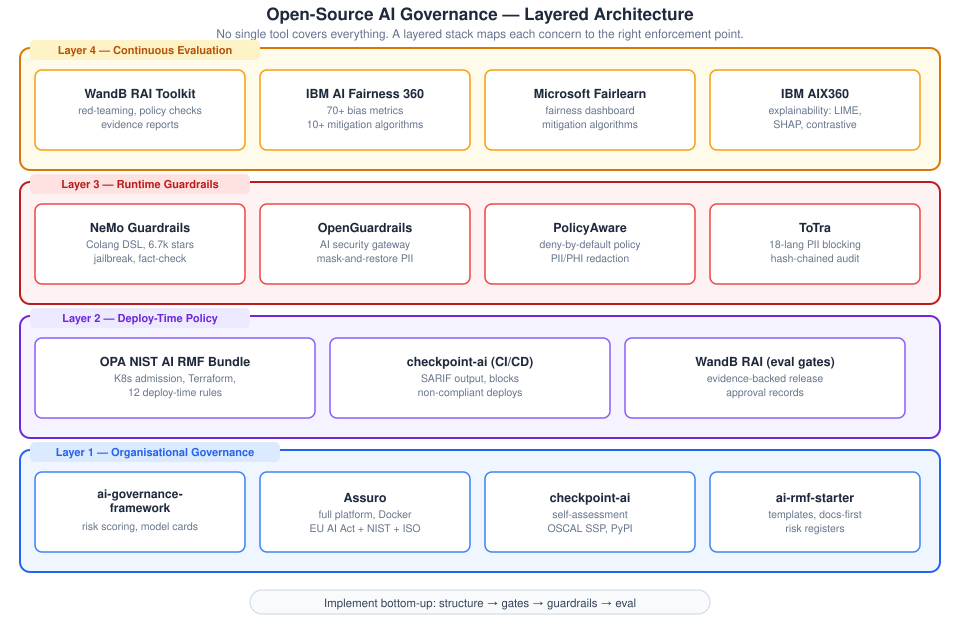
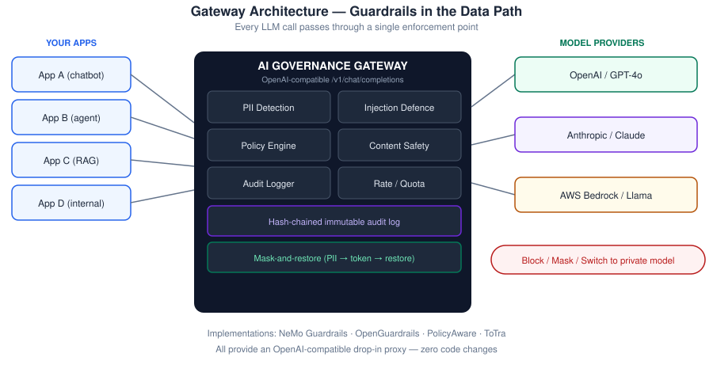
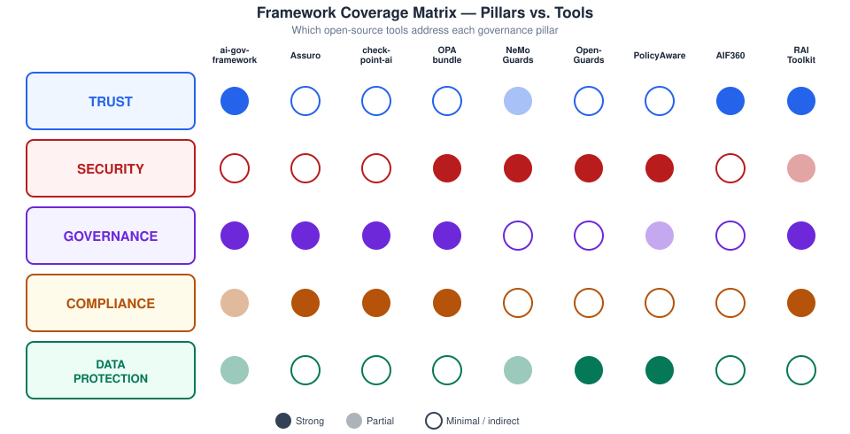
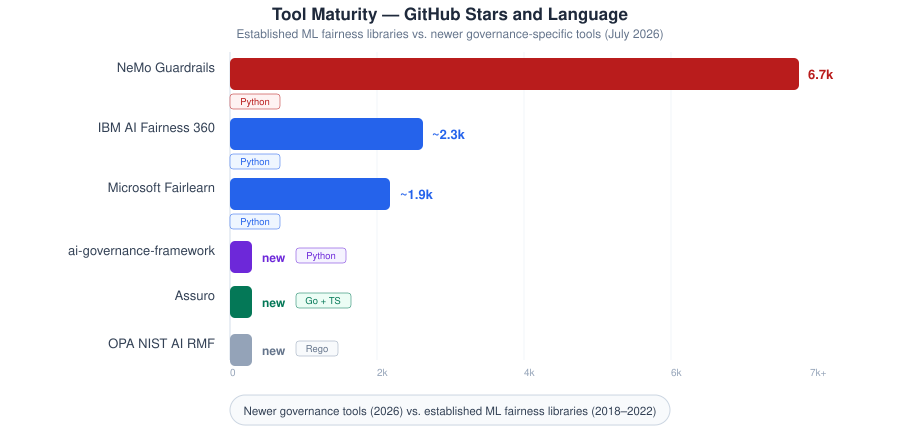
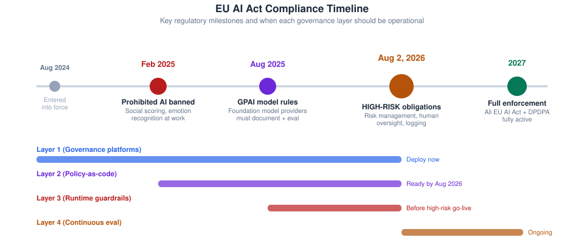

# Open-Source AI Governance Frameworks

**Companion report to *AI Governance in Practice: The NIST AI RMF Playbook***

Prepared by: Narendra Kalam  
Date: 17 July 2026  
Version: 1.0 — for internal review

---

## 1. Executive summary

No single open-source tool covers every pillar of AI governance. The market has settled on a **layered architecture**: organisational governance platforms at the base, policy-as-code at deploy time, runtime guardrails in the data path, and continuous evaluation on top. This report maps each layer to the five governance pillars (Trust, Security, Governance, Compliance, Data Protection) and recommends an implementation strategy aligned to the NIST AI RMF operating model.

**Key findings:**

- **5 full governance platforms** now exist that directly implement NIST AI RMF functions (Govern, Map, Measure, Manage)
- **4 LLM guardrail gateways** provide runtime PII redaction, prompt injection defence and audit logging as drop-in proxies
- **3 established fairness toolkits** (IBM AIF360, Microsoft Fairlearn, IBM AIX360) cover the Trust pillar with 70+ bias metrics
- **Policy-as-code** (OPA + Rego) can enforce NIST controls at deploy time in Kubernetes and Terraform
- A layered stack delivers all five pillars with **zero vendor lock-in**

> The editable diagrams supporting this report are in [`diagrams/`](diagrams/) — `framework_landscape.svg`, `framework_coverage.svg`, `framework_timeline.svg`, `gateway_architecture.svg`, `tool_maturity.svg`.

---

## 2. The four-layer architecture

Governance tools operate at different enforcement points. The recommended stack:

| Layer | Enforcement point | What it does | When to deploy |
|-------|-------------------|--------------|----------------|
| **1 — Organisational** | Before build | AI inventory, risk scoring, model cards, committee structure | Day 0–30 |
| **2 — Deploy-time** | CI/CD pipeline | Policy gates that block non-compliant workloads | Day 30–60 |
| **3 — Runtime** | Data path (proxy) | PII redaction, injection defence, content safety, audit logs | Day 60–90 |
| **4 — Evaluation** | Periodic + continuous | Red-teaming, bias audits, drift detection, fairness metrics | Day 90+ |

---

## 3. End-to-end governance platforms

These cover the full NIST AI RMF lifecycle.

### 3.1 faridukhan/ai-governance-framework

| | |
|---|---|
| **Language** | Python |
| **Regulations** | NIST AI RMF, EU AI Act |
| **Key capabilities** | Automated risk scoring, data lineage validation, bias detection toolkit, model card generator (Google spec + EU AI Act Art. 13), governance dashboard |
| **Maturity** | Enterprise-ready; structured around NIST functions |
| **Repository** | https://github.com/faridukhan/ai-governance-framework |

### 3.2 Assuro

| | |
|---|---|
| **Language** | Go (58.7%) + TypeScript (40.2%) |
| **Regulations** | EU AI Act, NIST AI RMF 1.0, ISO/IEC 42001 |
| **Key capabilities** | System registry, weighted risk scoring (historical), tamper-evident audit log (SHA-256), shadow AI discovery (AWS Bedrock, Azure AI, GCP Vertex, GitHub, HuggingFace), compliance score calculation, test suite management |
| **Deployment** | Single Docker stack, PostgreSQL only dependency |
| **Maturity** | Apache 2.0; created May 2026 |
| **Repository** | https://github.com/YASSERRMD/Assuro |

### 3.3 checkpoint-ai

| | |
|---|---|
| **Language** | Python (PyPI published) |
| **Regulations** | NIST AI RMF, EU AI Act, ISO 42001 |
| **Key capabilities** | Self-assessment cross-walked across frameworks, OSCAL-flavoured SSP generation, EU risk-tier classification, CI gating (JSON + SARIF output), MCP-native for AI agents |
| **Maturity** | Published on PyPI; polyglot ports (JS/Go/Rust) |
| **Repository** | https://github.com/cognis-digital/checkpoint-ai |

### 3.4 OPA NIST AI RMF Bundle

| | |
|---|---|
| **Language** | Rego (Open Policy Agent) |
| **Regulations** | NIST AI RMF, EU AI Act |
| **Key capabilities** | 12 deploy-time rules enforcing: risk tier declaration, data lineage, eval set requirement, prompt versioning, audit evidence sink, human oversight pattern, model version pinning |
| **Deployment** | Kubernetes admission controller, Terraform validation, CI policy check |
| **Maturity** | MIT licensed; reference implementation |
| **Repository** | https://github.com/uchit/opa-nist-ai-rmf |

### 3.5 WandB RAI Toolkit

| | |
|---|---|
| **Language** | Python |
| **Regulations** | NIST AI RMF, EU AI Act, MIT AI Risk Repository |
| **Key capabilities** | Evidence-backed AI review gates, adversarial red-teaming (32 attack templates), YAML policy checks, reviewer-pinned findings, JSON/HTML evidence reports, industry presets (healthcare, financial services, government) |
| **Maturity** | Active development; Weights & Biases ecosystem |
| **Repository** | https://github.com/wandb/rai-toolkit |

---

## 4. LLM guardrails and security gateways

These sit in the data path and enforce Security + Data Protection controls at runtime.

### 4.1 NVIDIA NeMo Guardrails

| | |
|---|---|
| **Stars** | 6,700+ |
| **Language** | Python |
| **Key capabilities** | Programmable rails via Colang DSL; jailbreak detection; fact-checking; hallucination detection; topic control; PII handling; content safety; LangChain integration |
| **Deployment** | Python SDK, API server, Docker, Kubernetes (Helm) |
| **Latest** | v0.23.0 (July 2026) |
| **Repository** | https://github.com/NVIDIA-NeMo/Guardrails |

### 4.2 OpenGuardrails

| | |
|---|---|
| **Language** | Go |
| **Key capabilities** | AI security gateway (OpenAI-compatible proxy); GenAI-powered PII detection; mask-and-restore anonymisation; prompt injection defence; 19-category content safety; multi-tenant configs; per-tenant rate limiting; policy-based routing to private models |
| **Repository** | https://github.com/openguardrails/agent-gateway |

### 4.3 PolicyAware

| | |
|---|---|
| **Language** | Python |
| **Key capabilities** | Deny-by-default policy enforcement; PII/PHI/secret redaction (Presidio integration); MCP tool governance; model routing; runtime evaluation; RBAC; audit traces; LangChain guardrails integration |
| **Repository** | https://github.com/ktirupati/policyaware |

### 4.4 ToTra

| | |
|---|---|
| **Language** | Go |
| **Key capabilities** | PII blocking across 18 language groups; per-user/team hard budget caps; cost tracking with chargeback; GDPR data-subject workflows; EU AI Act compliance checklist; hash-chained immutable audit log; SIEM integration |
| **Deployment** | OpenAI-compatible drop-in proxy |
| **Repository** | https://github.com/SugaC-275/ToTra |

---

## 5. Fairness, bias and explainability toolkits

These address the **Trust** pillar — making AI measurably fair and interpretable.

### 5.1 IBM AI Fairness 360 (AIF360)

- **70+ fairness metrics** and **10+ mitigation algorithms**
- Pre-processing, in-processing, and post-processing debiasing
- Works with scikit-learn, TensorFlow, PyTorch
- Donated to Linux Foundation AI & Data
- https://aif360.res.ibm.com/

### 5.2 Microsoft Fairlearn

- Fairness metrics dashboard for visual reporting
- Mitigation algorithms (reweighting, reductions)
- Allocation harm and quality-of-service harm assessment
- Azure ML integration
- https://fairlearn.org/

### 5.3 IBM AI Explainability 360 (AIX360)

- 8 explainability algorithms (LIME, SHAP, contrastive explanations, boolean rules)
- Supports tabular, text, image, and time-series data
- Donated to Linux Foundation AI & Data
- https://aix360.res.ibm.com/

---

## 6. Coverage matrix — pillars vs. tools

| Pillar | Primary tools | What they deliver |
|--------|---------------|-------------------|
| **TRUST** | AIF360, Fairlearn, AIX360, RAI Toolkit | Fairness metrics, bias detection, explainability algorithms, red-teaming |
| **SECURITY** | NeMo Guardrails, OpenGuardrails, PolicyAware, ToTra | PII redaction, injection defence, content safety, encryption enforcement |
| **GOVERNANCE** | ai-governance-framework, Assuro, checkpoint-ai, OPA bundle | AI inventory, model cards, risk scoring, version control, committee structure |
| **COMPLIANCE** | Assuro, checkpoint-ai, ToTra, RAI Toolkit | GDPR/HIPAA/DPDPA mapping, DPIA templates, audit trails, breach workflows |
| **DATA PROTECTION** | OpenGuardrails, PolicyAware, ToTra, Philterd | PII masking, data-subject rights, retention enforcement, minimisation |

---

## 7. Tool maturity and community

The landscape splits into two generations:

1. **Established ML fairness libraries** (2018–2022): IBM AIF360, Fairlearn, AIX360 — mature, well-documented, thousands of stars, but focused on tabular/classical ML bias
2. **LLM-era governance tools** (2024–2026): Assuro, ai-governance-framework, OpenGuardrails, OPA bundle — newer, fewer stars, but built specifically for generative AI regulatory requirements

Both generations are needed: the fairness libraries handle measurement; the governance platforms handle organisational structure; the gateways handle runtime enforcement.

---

## 8. EU AI Act timeline and tool readiness

| Deadline | What applies | What should be operational |
|----------|-------------|---------------------------|
| **Aug 2025** | GPAI model rules | Governance platform with model inventory |
| **Aug 2, 2026** | High-risk obligations (Annex III) | Full stack: governance + policy gates + guardrails + eval |
| **May 2027** | DPDPA full enforcement (India) | DPDPA-specific consent and breach workflows |

---

## 9. Recommended implementation strategy

### Phase 1: Organisational governance (Days 0–30)

Deploy **Assuro** or **ai-governance-framework** to:
- Register all AI systems in an inventory
- Compute risk scores per system
- Map controls to NIST AI RMF / EU AI Act / ISO 42001
- Generate model cards
- Name risk owners

### Phase 2: Deploy-time policy (Days 30–60)

Integrate **opa-nist-ai-rmf** into CI/CD to:
- Block deployments without declared risk tiers
- Require data lineage references
- Enforce prompt versioning (no inline prompts)
- Mandate audit-evidence sinks
- Gate on evaluation set coverage

Use **checkpoint-ai** for periodic self-assessments with SARIF output.

### Phase 3: Runtime guardrails (Days 60–90)

Deploy **NeMo Guardrails** or **OpenGuardrails** as a gateway proxy:
- All LLM traffic routes through a single enforcement point
- PII detected and redacted before data leaves the network
- Prompt injection attempts blocked
- Every request/response logged in a hash-chained audit trail
- Policy violations trigger block, mask-and-restore, or private-model routing

### Phase 4: Continuous evaluation (Day 90+)

Schedule **WandB RAI Toolkit** runs for:
- Adversarial red-teaming against production systems
- Policy compliance checks (EU AI Act Articles 9–15)
- Framework coverage computation (NIST, EU AI Act)

Pair with **IBM AIF360** and **Fairlearn** for:
- Bias measurement on production traffic samples
- Fairness audits split by customer group
- Drift detection on accuracy and equity metrics

---

## 10. References

- NIST AI 100-1 — AI Risk Management Framework 1.0 — https://doi.org/10.6028/NIST.AI.100-1
- NIST AI 600-1 — Generative AI Profile — https://airc.nist.gov/airmf-resources/
- EU AI Act — Official Journal of the EU, 2024 — https://eur-lex.europa.eu/eli/reg/2024/1689
- ISO/IEC 42001:2023 — AI Management System — https://www.iso.org/standard/81230.html
- NVIDIA NeMo Guardrails — https://github.com/NVIDIA-NeMo/Guardrails
- IBM AI Fairness 360 — https://aif360.res.ibm.com/
- Microsoft Fairlearn — https://fairlearn.org/
- IBM AI Explainability 360 — https://aix360.res.ibm.com/
- Assuro — https://github.com/YASSERRMD/Assuro
- ai-governance-framework — https://github.com/faridukhan/ai-governance-framework
- checkpoint-ai — https://github.com/cognis-digital/checkpoint-ai
- OPA NIST AI RMF — https://github.com/uchit/opa-nist-ai-rmf
- WandB RAI Toolkit — https://github.com/wandb/rai-toolkit
- OpenGuardrails — https://github.com/openguardrails/agent-gateway
- PolicyAware — https://github.com/ktirupati/policyaware
- ToTra — https://github.com/SugaC-275/ToTra

---

## Appendix: Visual assets

The [`diagrams/`](diagrams/) folder contains editable SVG sources for both reports:

**Original governance report:**
- `nist_cycle.svg` — NIST AI RMF core functions (Govern, Map, Measure, Manage)
- `characteristics.svg` — Seven trustworthy-AI characteristics
- `pillars.svg` — Five governance pillars (Trust, Security, Governance, Compliance, Data Protection)
- `lifecycle.svg` — AI system lifecycle with data governance + LLMOps foundations
- `adoption_gap.svg` — The adoption vs. governance gap (bar chart)
- `penalty_comparison.svg` — Regulatory fines on log scale
- `implement_once.svg` — One control set, many frameworks

**This frameworks report:**
- `framework_landscape.svg` — Four-layer open-source architecture
- `framework_coverage.svg` — Pillar vs. tool coverage matrix
- `framework_timeline.svg` — EU AI Act timeline with tool readiness
- `gateway_architecture.svg` — How guardrails sit in the data path
- `tool_maturity.svg` — Community size comparison (stars)
